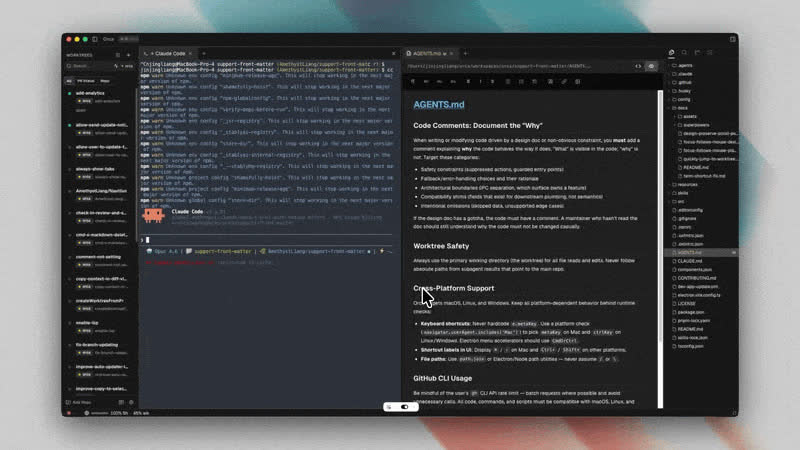
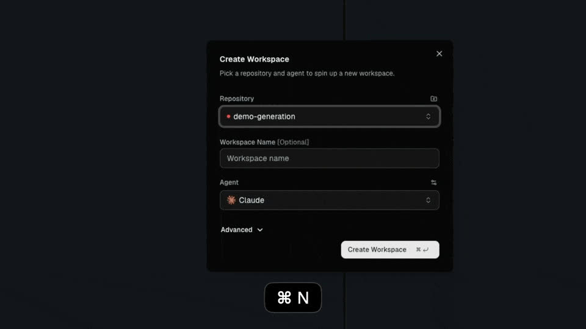

Orca — настольное приложение для работы с ИИ-агентами для программирования. Собственной модели у него нет: оно запускает те CLI-агенты, которыми вы уже пользуетесь, например Claude Code или Codex, и помогает следить за ними в одном окне.

Herdr из предыдущего урока организует терминалы вокруг проекта. Orca добавляет ещё один уровень: каждая задача получает собственный git worktree. `git worktree` — это дополнительный рабочий каталог того же репозитория. У него своя ветка и свои файлы на диске, но история репозитория общая. Раз каждый агент работает в своём каталоге, агенты никогда не правят файлы друг друга.

## Модель Orca

Orca раскладывает работу по четырём уровням:

- `Проект` — git-репозиторий, добавленный в Orca. Приложение считывает его ветку по умолчанию и делает её базовой — `base ref`, обычно это `origin/main`. Новые worktree по умолчанию ответвляются именно от неё.
- Worktree отводится под одну задачу. У него своя ветка, свои файлы и свои терминалы. В сайдбаре worktree перечислены под своим проектом, и каждый из них называется рабочим пространством.
- `Вкладка` вмещает что-то одно: терминал, файл в редакторе, страницу браузера, дифф или пулл-реквест. Вкладки живут в панелях, а панель можно разделить, чтобы видеть несколько вкладок сразу.
- `Agent session` — один CLI-агент, запущенный в одном терминале одного worktree. Orca отслеживает её состояние, поэтому всегда видно, какие агенты работают, а какие ждут вас.



Каждый worktree в Orca — самый настоящий git worktree. В любой момент можно открыть в нём терминал и выполнять обычные команды `git`. Если удалить worktree в Orca, то после подтверждения исчезнут и каталог, и ветка.

## Добавьте проект

Установку через Homebrew вы уже выполнили в обзоре курса. Откройте приложение из папки «Программы» или через Spotlight.

При первом запуске Orca просит доступ к домашнему каталогу, чтобы добавлять репозитории. Если у вас есть папки `~/.claude` и `~/.codex` или настройки терминала Ghostty, приложение предложит их импортировать. После этого откроется пустой стартовый экран.

Чтобы добавить первый проект:

1. Нажмите **Add project**. Эта кнопка есть и на стартовом экране, и в шапке сайдбара.
2. В диалоге **Add a project** выберите **Browse folder**.
3. Укажите локальную копию git-репозитория.

Тот же диалог умеет клонировать репозиторий через **Clone from URL** или заводить новый через **Create new project**. Добавленный проект появится в сайдбаре.

## Запустите первую сессию

Понадобится один CLI-агент для программирования — например, Claude Code или Codex, — уже установленный и авторизованный. Запускает его Orca, так что набирать команду агента самостоятельно не нужно.

1. Нажмите `Cmd+N` или щёлкните **+** рядом с названием проекта в сайдбаре. Откроется диалог создания нового worktree.
2. Убедитесь, что выбран нужный проект.
3. Введите в поле имени рабочего пространства короткое название задачи, например `explain-repo`. Имя необязательно: если оставить поле пустым, Orca придумает его самостоятельно.
4. Выберите агента в поле **Agent**. Можно выбрать и **Blank Terminal**, чтобы начать с обычной оболочки.
5. Нажмите `Cmd+Enter` или кнопку создания.



Orca создаёт worktree в фоне, переключает его на новую ветку и открывает. Выбранный агент запускается в первой вкладке, а его рабочим каталогом становится новый worktree.

Дайте агенту для начала безопасное задание, которое только читает код:

```text
Explain the structure of this repository in five bullet points.
```

По умолчанию Orca запускает поддерживаемых агентов с флагом полной автономии, и агент не спрашивает разрешения, прежде чем выполнить команду. Worktree уберегает основную рабочую копию от изменений агента, но это не изолированная среда с точки зрения безопасности. Начинайте с заданий, которые только читают код; где меняются права агентов, покажет следующий урок.

## Следите за статусом агентов

Открывать каждую вкладку, чтобы проверить агента, не нужно. Вкладки агентов и строки в сайдбаре показывают небольшой значок состояния:

- спиннер — агент работает;
- янтарный вопросительный знак — агент ждёт вашего разрешения или ответа;
- зелёная точка — агент закончил работу;
- красная точка — агент заблокирован, прерван или завершился с ошибкой;
- серая точка — агент простаивает.

Это состояние Orca узнаёт от самого агента. Если на вкладке нет значка, значит, Orca не распознаёт запущенную в ней программу. Поэтому запускайте агентов через встроенный выбор агента, а не набирайте команду в обычной оболочке.

Когда агент завершается, на его вкладке появляется кнопка **Restart**. Один щелчок — и тот же агент снова запущен в том же каталоге.

## Вкладки и разделение панелей

У каждого worktree свой набор вкладок. Для повседневной работы хватает нескольких сочетаний клавиш:

| Действие | Сочетание клавиш |
| --- | --- |
| Новая вкладка терминала | `Cmd+T` |
| Новая вкладка с агентом по умолчанию | `Cmd+Option+T` |
| Закрыть активную вкладку | `Cmd+W` |
| Следующая или предыдущая вкладка | `Cmd+Shift+]` / `Cmd+Shift+[` |

Чтобы разделить панель, перетащите вкладку к её краю. У правого края вкладки встанут рядом, у нижнего — одна над другой. Разделения можно вкладывать друг в друга, и вкладка любого типа уживается с любой другой. Вкладка терминала умеет делиться и сама: откройте её меню и выберите **Split terminal right** или **Split terminal down**.

Раскладку Orca запоминает отдельно для каждого worktree. Стоит переключиться на другой worktree — и его терминалы, файлы и разделения появятся ровно в том виде, в каком вы их оставили.

## Быстрые переходы: Quick Open и Jump Palette

Когда открыто несколько worktree, поиск нужного места начинает отнимать время. Для этого в Orca есть два клавиатурных инструмента:

- `Quick Open` (`Cmd+P`) ищет файлы в текущем worktree и открывает выбранный файл во вкладке редактора.
- `Jump Palette` (`Cmd+J`) ищет по всем worktree и всем открытым вкладкам. Введите часть имени проекта или worktree и нажмите Enter, чтобы перейти туда.

При пустом запросе Jump Palette первыми показывает недавние сессии агентов и терминалов, причём сессии, которым нужно ваше участие, стоят в самом верху. `Cmd+1`–`Cmd+6` переходят к первым строкам списка. `Shift+Enter` на строке worktree открывает его в новой панели, не заменяя текущую. Кнопка **Search** в верхней части сайдбара открывает ту же палитру.

## Закройте и вернитесь

При каждом запуске Orca восстанавливает прошлую сессию: открытые worktree, вкладки и разделения, прокрутку терминалов и вкладку, на которой был фокус.

Запущенные агенты переживают обычный выход из приложения. Терминалами владеет фоновый процесс, поэтому после `Cmd+Q` агенты продолжают работать — это похоже на отсоединение от сессии Herdr. При следующем запуске Orca снова подключается к тем же процессам. Так же всё происходит, когда Orca перезапускается ради обновления или падает.

Перезагрузка или отключение питания — другое дело: они останавливают всех агентов. При следующем запуске вернутся раскладка и последняя сохранённая прокрутка, но самих процессов агентов уже не будет. Нажмите **Restart** или снова запустите агента во вкладке.

Orca всегда восстанавливает последнюю сессию. Чтобы начать с чистого листа, закройте ненужные worktree перед выходом.

## Официальные материалы

- [What is Orca?](https://www.onorca.dev/docs)
- [Your first 3-agent session](https://www.onorca.dev/docs/first-session)
- [Worktrees](https://www.onorca.dev/docs/model/worktrees)
- [Tabs, panes, and split layouts](https://www.onorca.dev/docs/model/tabs-panes-splits)
- [Agents and sessions](https://www.onorca.dev/docs/model/agents-sessions)
- [Session restore](https://www.onorca.dev/docs/model/session-restore)
- [Quick Open and Jump Palette](https://www.onorca.dev/docs/model/quick-open)
