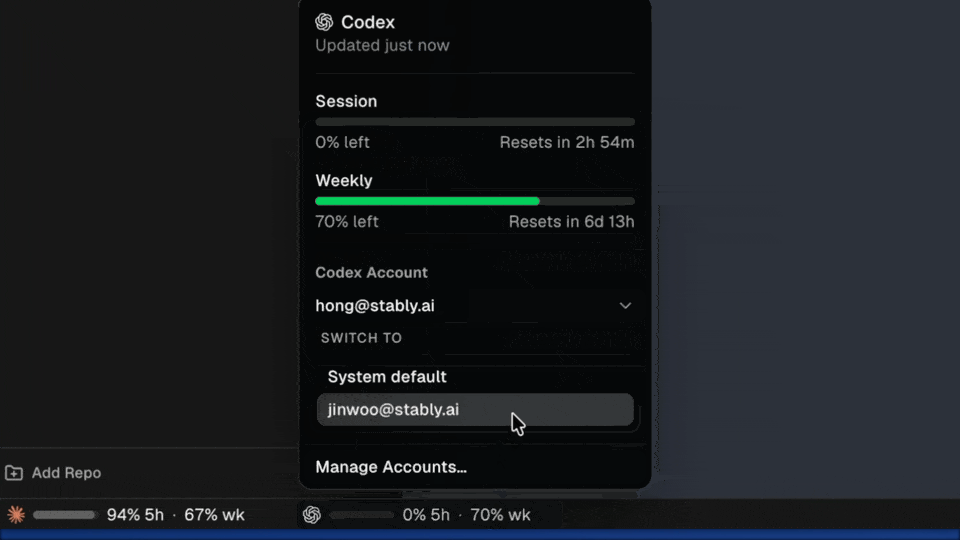

The previous lesson started one agent with Orca's defaults. Before real work, check three groups of settings. GitHub lets Orca show pull requests, issues, and checks. Agent settings decide which agent starts and how much it may do without asking. Workspace settings decide where each new worktree goes and what runs in it first.

## Open and search Settings

Press `Cmd+,` to open Settings. Settings are grouped into panes, such as **General**, **Integrations**, **Agents**, and **Notifications**. You do not need to remember where a setting lives. Type a keyword into the search field, such as `branch` or `github`, and Orca shows the matching settings.

Each project also has its own settings. Open the project's **⋯** menu in the sidebar and choose **Project Settings**. These settings apply only to that repository.

## Connect GitHub

Orca does not keep its own GitHub login. It talks to GitHub through the `GitHub CLI`, the `gh` command on your Mac, and uses whatever account `gh` is logged in to. So you need the GitHub CLI, and it must be logged in.

Open **Settings → Integrations** and find **GitHub Integration**. Its status is one of these:

- **Connected** means Orca can use `gh`, and pull requests, issues, and checks work.
- **Not authenticated** means `gh` is present but not logged in.
- **Not installed** means Orca cannot find `gh`.

To fix **Not authenticated**, run this command in a terminal and follow its prompts:

```sh
gh auth login
```

Then click **Re-check** on the card. To see which account `gh` uses, run:

```sh
gh auth status -h github.com
```

If you use several GitHub accounts, log in to each one with `gh`. Then choose the right one for a project under **GitHub Account** in its **Project Settings**. Other providers, such as GitLab, Bitbucket, Linear, and Jira, connect from the same **Integrations** pane.

## Fix common GitHub errors

When pull request status, checks, or issues stop updating, the cause is almost always login, access, or GitHub's API limits. The panel itself is rarely broken. Orca shows a short message. Match it with this table:

| Message | Likely cause | First thing to try |
| --- | --- | --- |
| GitHub authentication is unavailable | `gh` is not logged in, or its token has expired | Run `gh auth status -h github.com`, then `gh auth login` |
| GitHub is rate-limiting requests | Your hourly GitHub API quota is used up | Wait for the reset and stop extra `gh` scripts |
| GitHub did not allow access | The token lacks scopes, or you have no access to the repository | Log in again with the `repo` scope and open the pull request in a browser |
| Repository is unavailable | The remote is wrong, or the repository is private or renamed | Run `git remote -v` and open the repository in a browser |
| GitHub CLI is unavailable | `gh` is not on the PATH that Orca uses | Check that `gh` works in a normal terminal, then quit and reopen Orca |

A `rate limit` is an hourly budget of GitHub API calls for your account. Every tool on that account shares it: Orca, `gh` in your terminals, and agents that call `gh`. **Settings → Git & Source Control → GitHub API Budget** shows how much is left. These numbers can look fine while live calls still fail. When they disagree, trust the error on the pull request panel.

One mistake is easy to miss. If your `~/.zshrc` exports `GITHUB_TOKEN` or `GH_TOKEN`, `gh` uses that token instead of your login. A stale token causes confusing login and rate-limit errors. Remove the export line, open a new terminal, and log in again:

```sh
gh auth logout -h github.com
gh auth login -h github.com
```

After you log in again, restart Orca so it picks up the new credentials.

## Choose your agents

Orca can run any CLI agent in a terminal. Many agents, including Claude Code, Codex, Cursor CLI, Gemini, and GitHub Copilot CLI, appear in its agent picker ready to launch. Install and log in to each agent's CLI yourself first. Orca reads existing logins, such as `~/.claude` and `~/.codex`.

Open **Settings → Agents**. Its main controls are:

- The list of detected agents. Turn off the ones you do not use, so launch menus show only the agents you need.
- **Default Agent**. This agent is preselected when you create a worktree. Choose a specific agent, **Auto**, or **No agent (blank terminal)**. The **Agent** field in the create dialog also has a **Set as default** option.

### Decide how much an agent may do

By default, Orca starts every supported agent with its `permission-bypass flag`. This flag lets the agent run commands without asking you first. Examples are `--dangerously-skip-permissions` for Claude Code, `--dangerously-bypass-approvals-and-sandbox` for Codex, and `--yolo` for Gemini. The idea is that a worktree is disposable: you review the diff before anything is merged. A worktree is still not a security sandbox, as the previous lesson noted.

**Agent Permissions** switches all agents between two modes:

- **Yolo** keeps the bypass flags and gives you fewer prompts.
- **Manual** keeps each agent's own approval prompts.

To change one agent only, expand its row in the list. Edit its **Arguments** or **Environment** fields. **Reset** puts back the shipped value. Once you set a custom value, the global **Agent Permissions** switch no longer changes that agent.

Orca also respects each agent's own files. It reads a repository's `.claude/` and `.codex/` configuration, so your existing hooks still run. It does not change `CLAUDE.md` or `AGENTS.md`.

### Switch between agent accounts

Some people use more than one Claude or Codex account, for example a personal one and a work one. This step is optional. First log in to each account once from a terminal. Then open **Codex Accounts** or **Claude Accounts** in Settings, add the accounts, and give each one a clear name.

To switch, click the agent's usage chip in the status bar. Pick an account in the menu. **System default** is the login that a plain `codex` or `claude` command uses outside Orca.



New sessions use the account you picked. Agents that are already running keep their account until you restart them.

## Set up workspaces and worktrees

Orca creates every worktree as a folder on disk. Global settings decide where these folders go and how branches are named:

- **Workspace Directory** in **General** is the root folder for all worktrees. The default is `~/orca/workspaces`.
- **Nest Workspaces** in **General** puts each worktree inside a folder named after its repository. It is on by default, so a worktree path looks like `~/orca/workspaces/<repository>/<workspace>`.
- **Branch Prefix** in **Git & Source Control** adds a prefix to new branch names. Choose **Git Username** (the default), **Custom**, or **None**. With the username `jdoe`, the workspace `fix-login-race` gets the branch `jdoe/fix-login-race`.

When you leave the workspace name empty, Orca names it after a marine creature. Turn on **Auto-Rename Branch From Work** in **Git & Source Control** if you want Orca to rename such a branch after the agent starts working.

### Set defaults for one project

A project's **Project Settings** can override the global values:

- **Default Worktree Base** is the branch or ref that new worktrees start from. Orca sets it from your default branch, usually `origin/main`.
- **Worktree Location** puts this project's worktrees in another directory.

### Run a setup script

A new worktree is a clean checkout. Dependencies, build caches, and local secrets in ignored files are missing. A `setup script` fixes that. Orca runs it in the new worktree right after creating it.

You can save a setup script in two places. A local script lives in **Project Settings → Setup Script** and stays on your Mac. A shared script lives in an `orca.yaml` file at the repository root, so everyone who clones the repository gets it:

```yaml
scripts:
  setup: |
    pnpm install
```

The script can use three environment variables: `ORCA_ROOT_PATH` is the main checkout, `ORCA_WORKTREE_PATH` is the new worktree, and `ORCA_WORKSPACE_NAME` is the workspace name. An **Archive Script** works the same way but runs before Orca archives a worktree.

**When to Run Setup** controls the start:

- **Ask every time** asks before each run.
- **Run by default** runs the script automatically.
- **Skip by default** runs it only when you choose to.

To copy ignored files such as `.env` into every new worktree, list them in a `.worktreeinclude` file at the repository root:

```text
.env
.env.local
```

Each new worktree gets its own copy of these files. Only exact paths work here; patterns with wildcards are skipped.

## Tune notifications

Orca can tell you when an agent finishes, so you do not need to watch it. In **Settings → Notifications**, keep **Agent Task Complete** on. Click **Send Test Notification** to check that macOS shows Orca's notifications.

## Check your setup

Before the next lesson, go through this list:

| Setting | Where | Good starting value |
| --- | --- | --- |
| GitHub Integration | Integrations | Connected |
| Default Agent | Agents | The agent you use most |
| Agent Permissions | Agents | Yolo for disposable worktrees, Manual if you want prompts |
| Workspace Directory | General | `~/orca/workspaces` |
| Branch Prefix | Git & Source Control | Git Username |
| Default Worktree Base | Project Settings | `origin/main` |
| Setup Script | Project Settings or `orca.yaml` | The commands that prepare your project |
| Agent Task Complete | Notifications | On |

## Official resources

- [Settings reference](https://www.onorca.dev/docs/settings)
- [Troubleshooting GitHub errors](https://www.onorca.dev/docs/github-errors)
- [Supported agents](https://www.onorca.dev/docs/agents/supported)
- [Agents and sessions](https://www.onorca.dev/docs/model/agents-sessions)
- [Hot-swap Codex accounts](https://www.onorca.dev/docs/agents/codex-hot-swap)
- [Agent hooks and memory](https://www.onorca.dev/docs/agents/hooks-memory)
- [Worktrees](https://www.onorca.dev/docs/model/worktrees)
