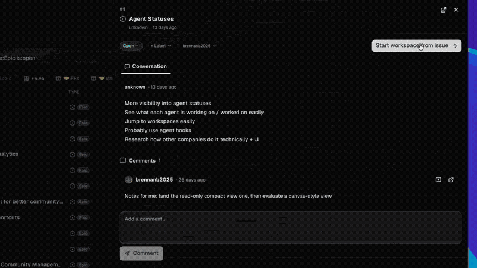
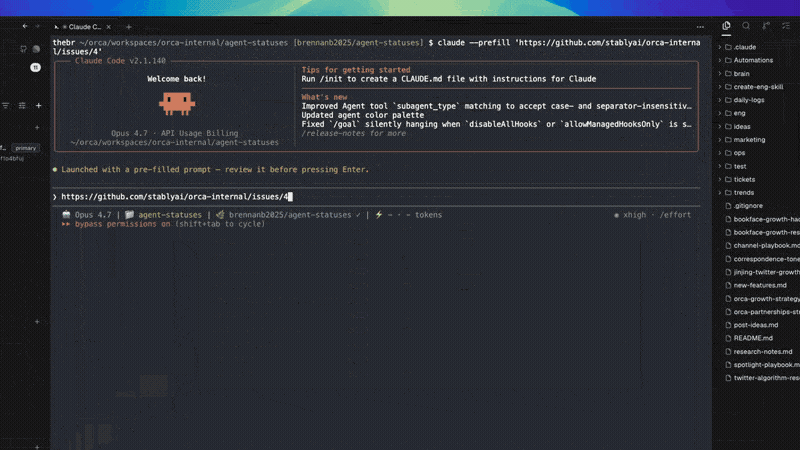
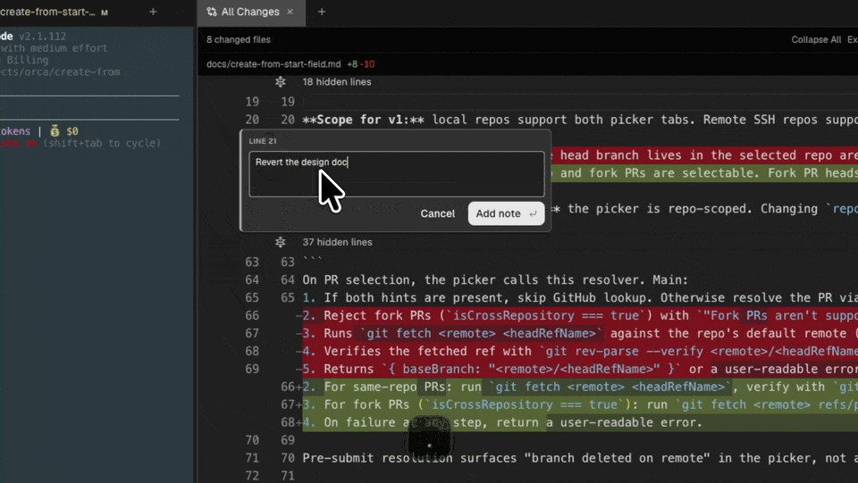

This lesson follows one task through the standard Orca flow. You start with a GitHub issue and end with a merged pull request. The steps work for any GitHub repository that you have added to Orca, as long as GitHub is connected as described in the previous lesson.

The flow has six stages:

1. Pick an issue.
2. Create a worktree for it and start an agent.
3. Test and review the agent's work.
4. Commit, push, and open a pull request.
5. Handle checks and review comments.
6. Merge and clean up.

## Pick an issue

Click **Tasks** in the left sidebar. The Tasks page shows GitHub work for your projects. Switch to **Issues** to see open issues, and use the search field to narrow the list.

Click an issue to open its details. You can read the description and comments here without going to github.com. When the issue is the one you want, click **Start workspace from issue**. The **Start** button on the issue row does the same.



## Create the worktree and start the agent

Orca opens the workspace composer. It already contains a name for the task and a link to the issue. Choose the **Agent** you want, then click **Create worktree** or press `Cmd+Enter`.

Orca creates a new git worktree in the background. The branch name comes from the workspace name, which Orca took from the issue. When the checkout is ready, the agent opens as the first tab of the worktree.

The issue is the agent's context. Orca starts the agent with a prompt that contains the issue link, so the agent can read the task from GitHub. With some agents, such as Claude Code, the prompt waits in the input. Read it, add any details you want, and press Return to send it.



## Watch the agent work

You do not need to stay in the agent's tab. The worktree card in the sidebar shows the same status marks that you met in the Orca Basics lesson. When the agent moves from working to idle, Orca sends a notification.

If an amber question mark appears, the agent waits for your permission or answer. Open its tab and reply. Otherwise, let the agent finish.

## Check the result

When the agent finishes, check its work yourself. An agent writes code fast, but you are still responsible for what you merge.

Start with the tests. Press `Cmd+T` to open a terminal tab in the same worktree. Run the project's tests there, for example:

```sh
npm test
```

Use the command that your project documents. You can also start the app and try the change by hand. The terminal runs in the worktree folder, so it sees exactly the agent's files.

Tests show whether the code works, but not whether the change is the right one. For that, review the diff in a short loop with the agent:

1. Read the diff.
2. Leave notes on the lines you want changed.
3. Send all notes to the agent in one batch.
4. Check the agent's revision.
5. Fix small things by hand.

### Read the diff

Press `Cmd+Shift+G` to open **Source Control** in the right sidebar. It lists the changed files in sections such as **Changes** and **Staged Changes**. If the agent has already committed its work, look under **Committed on Branch**. Click a file to see its `diff`, the lines that the agent added and removed. Click **View all** on a section to open its files as one combined diff in a tab.

The toolbar shows how many files changed. A file tree beside the diff lets you jump to a file. The toolbar can also switch between **Side by Side** and **Inline** layouts and turn on word wrap for long lines. Press `F7` to move to the next change and `Shift+F7` to move to the previous one.

First, look for obvious problems: unexpected files, deleted code, or changes outside the task. Then read the diff hunk by hunk. A `hunk` is one block of changed lines with a few unchanged lines around it. For each hunk, ask three questions:

- Is the change necessary?
- Is it minimal?
- Does it match the style of the rest of the file?

### Leave notes with Annotate AI Diff

`Annotate AI Diff` is Orca's way to comment on an agent's changes. You attach notes to lines in the diff and later send them to the agent. You do not copy file names or line numbers into the chat yourself.



To add a note:

1. Hover over a line in the diff. A **+** appears in the gutter.
2. Click the **+**. To comment on several adjacent lines, drag across them first.
3. Type your note in the box. Markdown works here.
4. Press Enter or click **Add note** to save it. Press `Shift+Enter` for a new line or Esc to cancel.

You can also use the keyboard. Select lines in the diff and press `Cmd+Shift+A`, the default shortcut for **Add Review Note**. A note stays pinned to its line. If the diff shifts after an edit, Orca moves the note with the line.

Write each note as a full sentence. Say what is wrong and what you expect instead:

```text
This retry loop never stops when the server returns 401. Stop after the first 401 and show the login error instead.
```

### Send the notes in one batch

Go through the whole diff before you send anything. When a diff has notes, its toolbar shows **AI notes** with a count and a **Send** button.

Click **Send**. Orca builds one prompt from all your notes, and each note keeps its file and line range. A **Send notes to** menu then lists the agents in this worktree. Pick the agent that wrote the change, or start a new agent from the same menu. After the prompt reaches the agent, Orca removes the sent notes from the diff.

Batching matters. If you send notes one at a time, the agent changes direction again and again. One batch gives it the full picture, so it can make one consistent revision.

**Send Review Notes to Agent** has no shortcut by default. To send from the keyboard, assign one in **Settings → Shortcuts**.

### Check the revision

Wait until the agent finishes, then open the diff again and check each point from your last batch. Your notes are gone from the diff, but the prompt with all of them stays in the agent's terminal. Scroll back there if you need to recall what you asked for.

- If a fix is wrong or incomplete, add a new note that explains what is still missing.
- If you change your mind about a note before you send it, remove it with **Delete note**.
- Send the new notes and wait for the next revision.

Repeat the loop until the diff is clean.

### Fix small things by hand

Sometimes a fix is faster to type than to explain, for example a typo, a wrong name, or a leftover debug line. Make such edits when the agent is idle, so you and the agent do not change the same file at the same time.

Open the file in Orca's editor. For example, press `Cmd+P` for Quick Open and type part of the file name. The editor is Monaco, the same editor that VS Code uses. It saves files automatically when you leave the editor or stop typing for a moment, so there is no save step.

To see your edit as a diff without leaving the file, turn on **Changes view mode** in the editor tab. It compares your working copy of the file with the last commit.

## Commit, push, and open a pull request

When the diff is clean, commit it from Source Control. The panel has one main button at the bottom. Its label changes to show the next useful step:

1. **Stage All** adds every changed file to the commit. You can also stage single files.
2. Write a commit message, or click **Generate commit message with AI** to get a draft from the staged changes. Then click **Commit**, or press `Cmd+Enter` while focus is in the panel.
3. **Publish Branch** pushes the new branch to GitHub for the first time. Later pushes use **Push**.
4. **Create PR** opens the pull request form.

Your repository's pre-commit hooks run as usual. If a hook fails, Orca shows its output. **Fix with AI** in the failure details hands the problem to an agent. It asks the agent only to repair the problem, not to skip the hooks.

In the pull request form, check the base branch, title, description, and **Draft** state. **Generate pull request details with AI** can write the title and description from your commits. Because the worktree is linked to the issue, the generated text can include a line like `Fixes #42`. GitHub closes issue 42 when a pull request with that line is merged into the default branch.

Review the text and create the pull request. The worktree card in the sidebar now shows the linked pull request and its status.

## Handle checks and review comments

Open the **Checks** panel in the right sidebar. Press `Cmd+L` if the right sidebar is hidden. The panel shows the pull request's status, its `checks`, and its comments. Checks are automated jobs, such as GitHub Actions workflows, that run on every push. Orca keeps refreshing them while the panel stays open.

A failed GitHub Actions check also shows a red chip on the worktree card. Click the check to read its job log inside Orca. To hand the problem to an agent, click **Fix** next to the failing checks. Orca gives the agent the names and links of the failed checks.

Review comments from teammates appear in the same panel. You can reply to any comment there. To address feedback with AI, click **Send unresolved PR comments** in the comments section. Orca passes those comments to an agent. You can also queue only some of them for the agent.

After each fix, follow the same loop: check the result, commit, and click **Push**. The pull request updates, and the checks run again.

## Merge the pull request

For an open pull request, the Checks panel shows a green merge button. Its label follows the repository's default merge method, for example **Squash and merge**. When checks pass and the review requirements are met, click it to merge the pull request from Orca.

If the button is disabled, hover over it to see the reason, such as pending checks, a required approval, or conflicts. Instead of waiting, you can choose **Enable auto-merge**. GitHub then merges the pull request when all its requirements pass. This option appears only when the repository allows auto-merge.

## Clean up the worktree

After the merge, the worktree has done its job. The Checks panel shows a **Delete Workspace** button for the merged pull request. You can also right-click the worktree in the sidebar and delete it there.

Orca asks for confirmation. Then it removes the worktree folder and its local branch. The merged code stays in the repository's default branch. If the pull request description used a closing keyword such as `Fixes #42`, GitHub has already closed the issue.

## Official resources

- [Hosted reviews, issues & Actions](https://www.onorca.dev/docs/review/github)
- [Diff viewer](https://www.onorca.dev/docs/review/diff-viewer)
- [Annotate AI Diff](https://www.onorca.dev/docs/review/annotate-ai-diff)
- [Review an AI diff line-by-line](https://www.onorca.dev/docs/recipes/review-ai-diff)
- [Monaco editor and autosave](https://www.onorca.dev/docs/editing/monaco)
- [Commit & push from Orca](https://www.onorca.dev/docs/review/commit-push)
- [Worktrees](https://www.onorca.dev/docs/model/worktrees)
- [Agents & sessions](https://www.onorca.dev/docs/model/agents-sessions)
- [Troubleshooting GitHub errors](https://www.onorca.dev/docs/github-errors)
