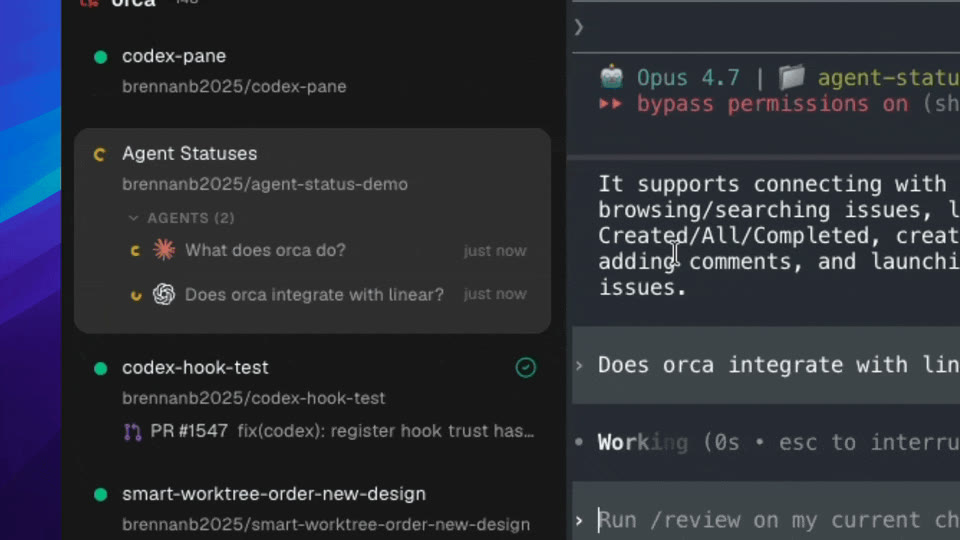
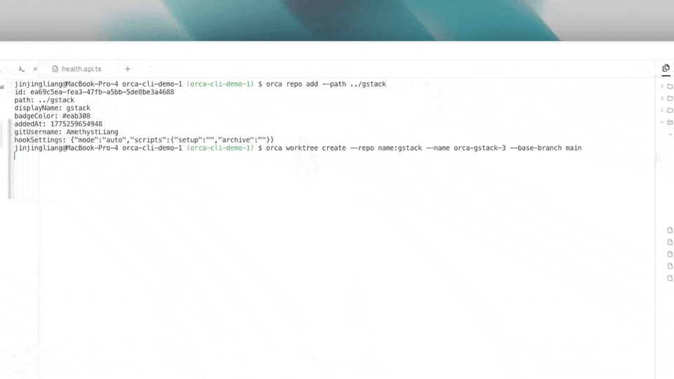

Different agents make different mistakes. Orca lets you give the same task to several agents at once and keep the best answer. The Orca docs call this a `race`: one prompt, several branches, one winner.

Each agent works in its own git worktree. A worktree has its own branch, its own files on disk, and its own agent terminals. So the agents never touch each other's files, and you can delete a losing attempt without any effect on the others.

This lesson runs a race by hand first. Then it does the same from a shell and shows how one agent can hand work to other agents.

## Start the race

The Orca docs describe a race with three agents:

1. Create three worktrees from the same `start-from ref`, the branch or commit that a worktree branches off. Usually this is your base ref, such as `origin/main`. Give them related names, for example `fix-bug`, `fix-bug-2`, and `fix-bug-3`.
2. Launch a different agent in each worktree, for example Claude Code, Codex, and Cursor CLI. The agent selector in the create dialog launches the chosen agent as the first tab.
3. Paste the same prompt into all three agents.
4. Let them work.

The same start-from ref and the same prompt matter. They make the results comparable: any difference between the diffs comes from the agent, not from the setup.

Start agents through Orca's agent selector instead of typing the command into a plain shell. Orca shows status only for agent CLIs that it recognizes.

## Watch the agents work

To see several agents at once, drag a tab to the right or bottom edge of a pane. Orca splits the pane, and you can place agents next to each other.


You do not need to watch every terminal. Orca tracks each `agent session`, which is one agent CLI running in one terminal in one worktree. The worktree rows in the sidebar show the same status marks as the agent tabs, which you met in the Orca Basics lesson. So one look at the sidebar tells you how every attempt is doing.



Handle the agents that wait on you first. A waiting agent makes no progress until you answer. Then review the agents that are done.

## Jump between worktrees

With several attempts running, navigation becomes the bottleneck. Besides the Jump Palette (Cmd-J), Orca gives you a few ways to reach the right place quickly:

- When an agent finishes, Orca sends a notification. The bell in the header collects unread notifications from all worktrees. Click one to jump to the matching worktree and pane. On macOS, the Dock icon shows the same unread count.
- The `Agents` entry in the sidebar opens a feed of agent events across every worktree. Use it to catch up after you have been away.
- For a board view, turn on Settings → Experimental → Agent Dashboard. It sorts agents from all worktrees into the columns Needs You, Working, Done, and Idle. Click a card to open that agent's terminal.

## Compare the results

When the agents settle, open each worktree's diff view. It shows the changes against the worktree's start-from ref. Because all attempts started from the same ref, you compare like with like.

Read the attempts as a signal, not only as candidates:

- Where all agents agree, the answer is probably right.
- Where they split, you have found the hard part of the task. Look there most carefully.

Pick the attempt that solves the task with the smallest, clearest change. You can also take a good idea from a losing attempt and ask the winning agent to add it.

## Ship the winner and delete the rest

Treat the winner like any other task from the From Issue to Merged Pull Request lesson. Review its diff, send your comments with Annotate AI Diff, then commit, push, and open a pull request from the winning worktree.

Delete the losing worktrees. Right-click a worktree in the sidebar and choose delete. You can also hover over it and press Cmd-Shift-Backspace. Orca asks for confirmation and then removes both the worktree folder and its branch. To delete several at once, Cmd-click to select them, then right-click any selected worktree.

If git refuses to drop a branch because it may still contain unmerged commits, Orca keeps that branch and can offer a review step. There you decide which kept branches to force-delete.

Delete finished worktrees quickly. A long list of old attempts only slows down the jump palette.

## Run the race from a shell

Clicking through three create dialogs gets old fast. The `Orca CLI` is the `orca` command. It talks to the running Orca app, so you, a script, or an agent can create worktrees and talk to agent terminals.

Terminals inside Orca already have the `orca` command. To use it in other terminals on your Mac, open Orca's settings and go to **General → Orca CLI**. Turn on the **Shell command** switch and confirm with **Register**. Then check that your shell finds the command and can reach Orca:

```sh
command -v orca
orca status --json
```

Add `--json` when a script or an agent will read the result. Without it, the output is short text for people. Every command also has built-in help, for example `orca worktree create --help`.

Most commands accept a `selector` instead of a long ID. A selector names a repository or a worktree with a short prefix:

| Selector | What it finds |
| --- | --- |
| `active` | The Orca worktree that contains the current shell directory |
| `id:<id>` | The item with this exact ID from a `--json` result |
| `branch:<name>` | The worktree for this branch |
| `name:<name>` | The repository with this display name |

Now create a worktree. `--repo` picks the repository, `--name` names the worktree, and `--base-branch` sets its start-from ref. Run `orca repo list --json` to see the repositories that Orca knows.



Add `--agent` to launch an agent in the first terminal and `--prompt` to send it the first task. Three such commands start the whole race:

```sh
PROMPT="Fix the flaky login test. Keep the change small."
orca worktree create --repo name:my-app --name fix-bug --base-branch main --agent claude --prompt "$PROMPT" --json
orca worktree create --repo name:my-app --name fix-bug-2 --base-branch main --agent codex --prompt "$PROMPT" --json
orca worktree create --repo name:my-app --name fix-bug-3 --base-branch main --agent cursor --prompt "$PROMPT" --json
```

Orca creates each worktree in the background and does not switch your view. Add `--activate` when you want to see one right away. To get a compact summary of every worktree, run `orca worktree ps --json`.

## Steer agents from a shell

Each live terminal has a `handle`, a short ID that `orca terminal list` reports. Read a terminal before you send anything, so you know what the agent is waiting for:

```sh
orca terminal list --json
orca terminal read --terminal <handle> --json
orca terminal send --terminal <handle> --text "continue" --enter --json
orca terminal wait --terminal <handle> --for tui-idle --timeout-ms 300000 --json
```

`send` types the text, and `--enter` submits it. `wait --for tui-idle` blocks until the agent's terminal interface becomes idle or the timeout ends. After that, read the terminal again to see the answer. Handles belong to the running Orca app. If Orca restarts, list the terminals again to get fresh handles.

Agents can report back too. Every Orca worktree has a short free-text comment, a `worktree checkpoint`, that is visible in the UI. Ask each agent in your prompt to update it at every milestone. Then you can follow each attempt without reading its terminal. The agent runs a command like this:

```sh
orca worktree set --worktree active --comment "reproduced auth failure; testing credential-chain fix" --json
```

## Hand the coordination to an agent

In a race, you are the coordinator. When one agent should split a larger job, hand the parts to other agents, and collect the results, use `orchestration`. Orca marks this layer as experimental, so its flags can still change.

The model has four parts:

- A `Run` is a namespace with an inbox for the coordinating agent.
- A `task` is one work item with a spec and a status.
- A `worker` is a supervised agent that Orca starts for a task. Each attempt to run a task on a terminal is a `dispatch`.
- A worker reports back with exactly one `worker_done` message, even when it fails.

A coordinator, usually an agent in an Orca terminal, runs this loop:

```sh
orca orchestration run-create --objective "Split checkout QA and summarize blockers" --json
orca orchestration task-create --spec "Audit billing settings for mobile layout" --task-title "Billing audit" --json
orca orchestration worker-start --task <taskId> --worktree new-child --name billing-audit --agent codex --json
orca orchestration check --wait --types worker_done,escalation,question --timeout-ms 900000 --json
```

`--worktree new-child` gives the worker its own child worktree, so workers stay apart just like racing agents. `check --wait` blocks until a matching message arrives. Orca gives each worker its task and dispatch IDs, and the worker includes both when it reports the result:

```sh
orca orchestration send --type worker_done \
  --subject "Completed mobile audit" \
  --body "Fixed footer overlap; no follow-ups." \
  --task-id <taskId> --dispatch-id <dispatchId> \
  --outcome succeeded --json
```

You rarely type these commands yourself. Usually you ask a coordinator agent to split the work, and the agent runs them. Before it changes orchestration state, the agent should load the full guide for your Orca version with `orca skills get orchestration --full`. To teach your agents the CLI and orchestration permanently, install Orca's agent skills as described in [Orca skills registry and MCP](https://www.onorca.dev/docs/cli/skills).

## Decide when a race is worth it

A race multiplies the work. Three agents use roughly three times the usage of one agent, and you must review three diffs instead of one. Still, it is often cheaper than several retries in a row with one agent. Orca shows usage for tracked providers such as Claude Code and Codex in the status bar. It shows a warning chip when you cross 80% of a limit. Click the usage segment to see every provider in the Usage popover.

A race is usually worth it when:

- the task is hard or ambiguous, and you do not know the best approach;
- a wrong answer is expensive, and agreement between agents gives you more confidence;
- you want to compare how different agents handle your codebase.

Run a single agent when:

- the task is small and clear, such as a rename or a one-line fix;
- reviewing several diffs would take longer than one retry;
- you are close to a usage limit.

## Official resources

- [Race three agents on the same task](https://www.onorca.dev/docs/recipes/parallel-agents)
- [Your first 3-agent session](https://www.onorca.dev/docs/first-session)
- [Jump between 10 worktrees](https://www.onorca.dev/docs/recipes/jump-worktrees)
- [Agents & sessions](https://www.onorca.dev/docs/model/agents-sessions)
- [Orca CLI overview](https://www.onorca.dev/docs/cli/overview)
- [Orca CLI reference](https://www.onorca.dev/docs/cli/reference)
- [Worktree checkpoints](https://www.onorca.dev/docs/cli/worktree-checkpoints)
- [Orchestration](https://www.onorca.dev/docs/cli/orchestration)
- [Usage & rate-limit tracking](https://www.onorca.dev/docs/agents/usage-tracking)
