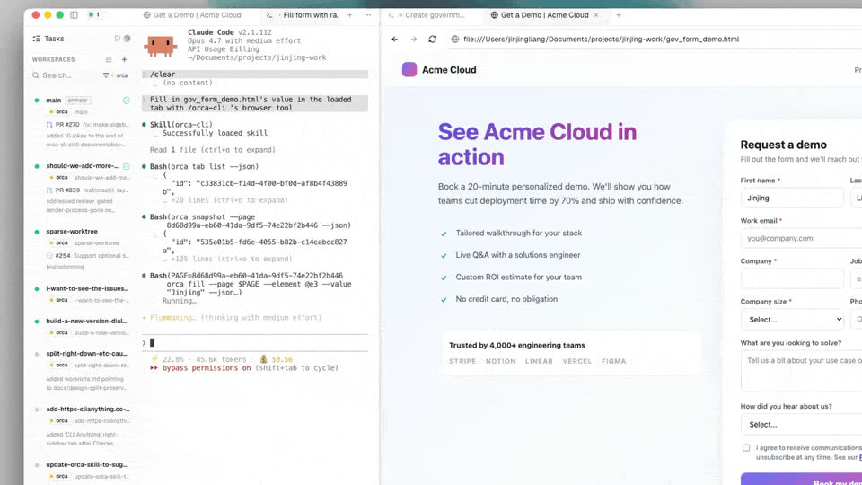
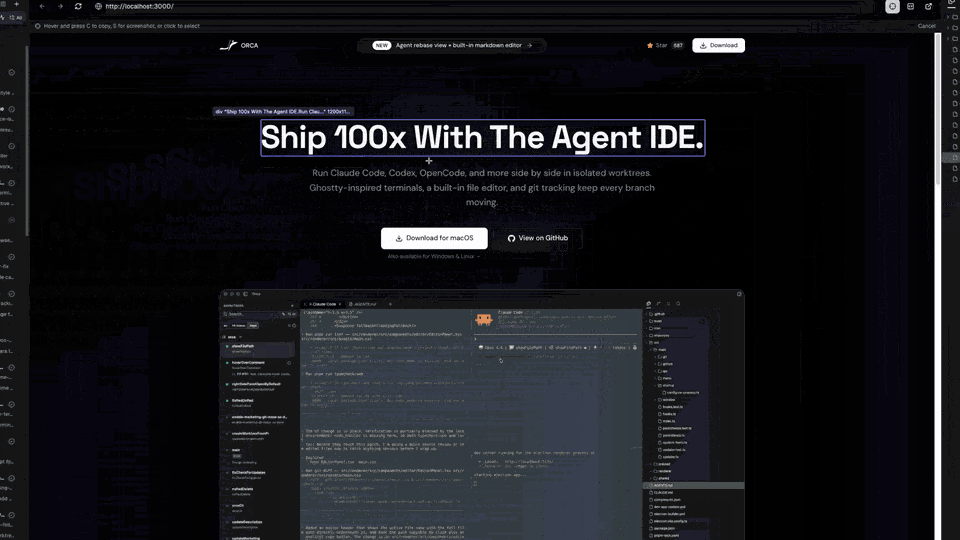

Работая над интерфейсом, нужно видеть запущенное приложение. В Orca ради этого не приходится переключаться на отдельный браузер: у каждого worktree есть собственный, поэтому страница и агент, который её меняет, оказываются рядом. А Design Mode позволяет просто указать на сломанный элемент, а не описывать его словами.

## Браузер внутри worktree

Встроенный браузер Orca, `per-worktree browser`, — это настоящий Chromium, открытый во вкладке Orca. В нём есть адресная строка, история и devtools. Его вкладки принадлежат одному worktree: стоит переключиться на другой worktree, и Orca восстановит уже его вкладки браузера вместе с позицией прокрутки.

Так параллельная работа не смешивается. Один агент чинит шапку сайта в своём worktree, а вы тем временем проверяете другую ветку приложения в соседнем. Каждый worktree показывает только свои страницы.

## Сервер разработки рядом с агентом

Запустите сервер разработки проекта во вкладке терминала этого worktree, например:

```sh
npm run dev
```

Сервер выведет локальный адрес вроде `http://localhost:3000`. Щёлкните по этой ссылке прямо в терминале — появится небольшое всплывающее меню. Выберите в нём **Orca Browser**, и страница откроется в браузере текущего worktree. Cmd-click обходит меню и открывает ссылку сразу. Куда именно она откроется в этом случае — во встроенный браузер Orca или в системный, — задаётся в **Settings → Browser → Link Routing**.

Можно поступить и иначе: нажать **+** в строке вкладок и ввести адрес там.

Теперь поставьте страницу рядом с агентом. Перетащите вкладку браузера к правому краю панели агента, и Orca разделит её: терминал агента останется слева, а браузер откроется справа.



Во время работы над интерфейсом пригодятся несколько клавиш браузера:

| Действие | Клавиши |
| --- | --- |
| Открыть новую вкладку в этом worktree | `Cmd-T` |
| Вернуть последнюю закрытую вкладку | `Cmd-Shift-T` |
| Найти на странице | `Cmd-F` |

Если щёлкнуть правой кнопкой по кнопке перезагрузки, можно выбрать **Hard Reload**. Такая перезагрузка обходит кэш, что удобно, когда вы меняете локальные файлы фронтенда. А чтобы проверить адаптивную вёрстку, задайте вкладке браузера собственный размер viewport — менять размер всей панели для этого не нужно.

## Указать на элемент через Design Mode

`Design Mode` превращает браузер в инструмент, который ведёт от элемента на странице к коду. Включите переключатель **Design Mode** на панели инструментов браузера. Курсор станет указателем выбора: при наведении на страницу Orca подсвечивает элемент под ним.



Щёлкните по элементу, чтобы захватить его. Orca соберёт:

- HTML элемента вместе с небольшим фрагментом окружающей разметки;
- его вычисленные стили CSS — цвета, шрифты, отступы;
- обрезанный скриншот элемента;
- исходный файл и строку, если доступна source map в режиме разработки.

Всё это Orca отправляет в активный терминал агента одним вложением, а вам остаётся написать, что нужно изменить. Агент получает тот же контекст, который понадобился бы живому ревьюеру, так что не нужно ни делать скриншот вручную, ни копировать CSS-селектор.

Если хочется сначала собрать несколько замечаний, а уже потом отправить их, воспользуйтесь панелью аннотаций. Наведите курсор на заметку и выберите **Edit**, чтобы её поправить. После того как промпт доставлен, Orca убирает отправленные заметки.

## Исправляем небольшой баг в интерфейсе

Допустим, у кнопки на странице слишком тесные внутренние отступы. Запустите агента в worktree и откройте страницу в браузере рядом с ним. Дальше цикл выглядит так:

1. Откройте во встроенном браузере worktree страницу с ошибкой.
2. Включите Design Mode.
3. Щёлкните по неудачной кнопке — она попадёт в терминал агента как вложение.
4. Напишите, что изменить, например: «Здесь слишком тесные отступы. Увеличь их, как у карточек выше».
5. Дождитесь, пока агент отредактирует исходники. Если сервер разработки поддерживает hot reload, страница обновится сама.
6. Снова щёлкните по кнопке и проверьте результат. Если что-то по-прежнему не так, опишите, что осталось, и повторите.
7. Когда кнопка выглядит как надо, просмотрите дифф и сделайте коммит.

Весь цикл умещается в одном окне: страница, элемент, агент и само изменение.

## Профиль для страниц со входом

Некоторые страницы доступны только после входа в аккаунт. Профиль, `browser-use profile`, даёт браузеру отдельную идентичность: собственные cookies, local storage и кэш. Профили не делятся этими данными друг с другом.

Создайте профиль в **Settings → Browser → Profiles** кнопкой **Add profile**, а затем выберите его на панели инструментов браузера. В профиль можно импортировать cookies из Chrome или Edge. Входы в Google при этом не переносятся, поэтому в Google нужно войти прямо в Orca.

## Официальные материалы

- [Per-worktree browser](https://www.onorca.dev/docs/browser/overview)
- [Design Mode](https://www.onorca.dev/docs/browser/design-mode)
- [Fix a UI bug with Design Mode](https://www.onorca.dev/docs/recipes/design-mode-fix)
- [Browser-use profiles](https://www.onorca.dev/docs/browser/profiles)
- [Tabs, panes, and split layouts](https://www.onorca.dev/docs/model/tabs-panes-splits)
