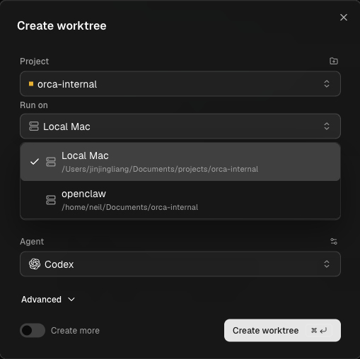

Sometimes your Mac is not the best place to run agents. A long build may need a faster machine. A task may need a GPU. You may want agents to keep running while your laptop sleeps. Orca solves this with an `SSH worktree`: a worktree that lives on a remote host and is controlled from Orca on your Mac.

## What runs where

An SSH worktree splits the work between two machines:

- The **remote host** stores the repository and the git worktree. Agents, terminals, and git commands run there.
- **Orca on your Mac** shows the editor, the diff, and the rest of the interface. It owns the connection and drives the host.

Orca syncs file events over the connection, so the remote worktree feels like a local one. You use the same editor, the same diff view, and the same agents. Only the compute is different.

## Add an SSH target

An `SSH target` is a remote host saved in Orca. You need SSH access to the host. If you work with a repository, git must be available on the host. The agent also runs there, so its CLI and its login must exist on the host, not only on your Mac.

To add a target:

1. Open **Settings → SSH** in Orca.
2. Click **Add Target**.
3. Fill in the host, user, port, and an optional identity file. Instead, you can open the **OpenSSH config** picker in the same dialog. It searches `~/.ssh/config` and fills the form from the host you pick.
4. Click **Test** to check the connection, then click **Save**.

If your key has a passphrase, Orca asks for it the first time. Orca keeps passphrases in memory until you close the app.

Saved targets appear in a list in **Settings → SSH**. Each row shows the target name, its `user@host:port`, its connection state, and buttons such as **Connect** and **Test**. The **Import** button adds hosts from your OpenSSH config in bulk.

Orca also checks the `host key`, the key that proves the server's identity. A host that already matches your `known_hosts` file connects silently. With the default policy, Orca trusts a new host on first contact and remembers it. If a known host suddenly shows a different key, Orca rejects the connection before it asks for any password or passphrase. Check the new fingerprint before you follow the recovery steps in the error.

## Create a remote worktree

Create a worktree as usual. In the create dialog, open **Run on** and choose your SSH target instead of the local Mac. Orca runs `git worktree add` on the remote host.

The **Run on** list shows ready hosts. It also shows hosts that are connected but do not know your project yet. For such a host, choose **Set project location** in the same form. Then browse to an existing checkout on the host, or clone the repository onto it. A disconnected host can offer **Connect** right in the list.

After that, work as you do locally:

1. Launch an agent. It runs on the remote host, not on your laptop.
2. Edit files in Orca's editor. Orca sends each save to the remote file system.
3. Review the diff, commit, and push from Orca on your Mac.

To copy something back, right-click in the file explorer of the SSH worktree. Choose **Download** for a file or **Download Folder** for a folder. Folder download appears only when the connection supports it.

## Survive disconnects

A remote worktree shows a status chip with the live SSH state. Green means connected, yellow means reconnecting, and red means disconnected. When a host drops, its workspace card can show an inline control to connect again.

A disconnect does not stop running agents. When your laptop sleeps or the Wi-Fi drops, the agent keeps working on the host. Orca reconnects, attaches the terminal again, and replays the output you missed. Agent states such as working, idle, and blocked reach the sidebar from the remote host as they do locally.

This works because Orca installs a small `relay` on the remote host on the first connection. The relay owns the remote terminal sessions. So even when you close Orca on your Mac, the remote terminals stay alive. When you open Orca again and reconnect, they return to their tabs with their scrollback.

This is the same idea you met with tmux and Herdr. There, a server process on the remote host kept your shells alive between SSH connections. In Orca, the relay does that job for you.

Remote terminals need a native module. On a Linux host, the relay may compile it, which needs `make`, a C++ compiler, and `python3`. Without these tools, files, git, and the editor still work, but terminals do not start. After the host has these tools, reconnect so the relay can finish its setup.

## Forward ports

An agent may start a development server on the remote host. To open it on your Mac, use `port forwarding`, which makes a remote port reachable on your laptop.

For a remote worktree, the right sidebar has a **Ports** tab. Press Cmd+Shift+I to show it. Orca lists the ports that listen on the remote host under **Detected**. One click forwards a port to your Mac. You can also add, edit, or remove forwards by hand.

Forwards persist across app restarts and SSH reconnects. A privileged remote port, such as 80, is mapped to a different local port automatically, for example 10080.

Orca's built-in browser can also reach the host's network. In **Settings → Browser**, the **Browse through SSH workspace hosts** option sends browser traffic and DNS through each workspace's SSH host. Turn it off to browse from your Mac instead.

## SSH worktree or Remote Orca Server

Orca has another remote mode: a `Remote Orca Server`. Here, the full Orca runtime runs on the other machine. That machine owns the projects, worktrees, terminals, and agents. Your Mac, a browser, or the phone app connect to it as clients. This mode is in beta.

| Question | SSH worktree | Remote Orca Server |
| --- | --- | --- |
| Who owns the runtime | Orca on your Mac | Orca on the remote machine |
| What the remote machine needs | SSH access, git, and agent CLIs | A running Orca desktop app or `orca serve` |
| Who can connect | One laptop drives the host | Laptop, browser, mobile, and automation share one runtime |
| Typical setup | Add a target, then pick it under **Run on** | Create an access link on the server, then paste it under **Add Server** |

Choose SSH worktrees when you already have a dev box or a server and want agents there without a second Orca install. Choose a Remote Orca Server when one always-on machine should keep every session for several clients. You can mix modes in one install: local worktrees for quick edits and an SSH host for heavy work.

## Official resources

- [SSH worktrees](https://www.onorca.dev/docs/ssh)
- [Work on a remote machine over SSH](https://www.onorca.dev/docs/recipes/remote-worktrees)
- [Ways to run Orca](https://www.onorca.dev/docs/ways-to-run)
- [Remote Orca Servers](https://www.onorca.dev/docs/remote-servers)
- [Troubleshooting](https://www.onorca.dev/docs/troubleshooting)
